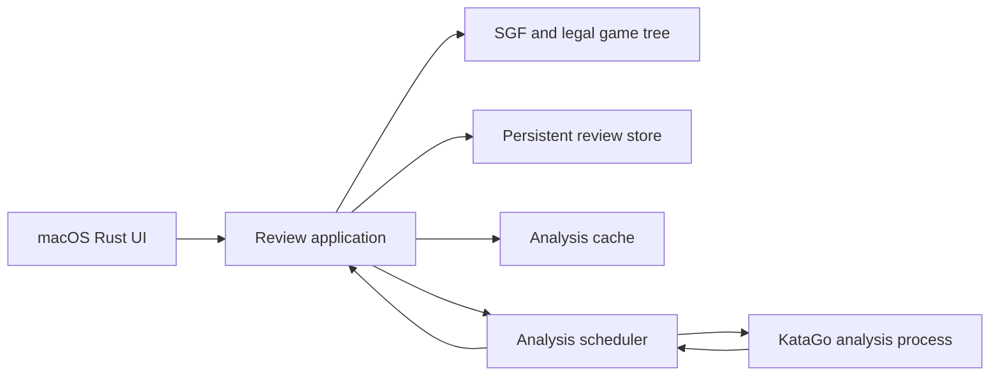

# Architecture and integration test plan

Implement a framework-independent Rust application layer behind an egui/eframe shell. It owns the SGF document, Go rules, original main line, user variations, analysis scheduler, and persistence. The GUI translates input into application commands and renders returned state. This is a proposed design; the listed tests and features are not implemented yet.

## Components



Start with one application library and one desktop binary. Separate modules for game rules, SGF, tree layout, protocol, scheduler, and storage are enough initially; introduce workspace crates when they improve dependency boundaries. Proposed dependencies are `serde`/`serde_json`, `rusqlite`, a cryptographic content hash, `eframe`, compatible `egui_plot`, and `egui_kittest` for tests. Evaluate Rust SGF and Go-rule libraries against the fixtures before choosing them. Pin a mutually compatible dependency set and commit `Cargo.lock` when the Rust application is created.

Engine readers, the writer queue, and database work run outside the UI thread. The app receives typed events. Coalesce intermediate updates and request a redraw after meaningful changes; preserve final results and database commits. Bound outstanding requests rather than enqueueing unbounded deep searches.

## SGF import and the variation tree

Preserve the SGF node tree and properties. A document has stable node IDs, parent IDs, ordered children, move/setup data, and explicit provenance. Store an immutable list of the originally imported main-line IDs, following the SGF's first-child line at import. Comments and setup nodes do not necessarily correspond one-to-one with moves; maintain the mapping from node IDs to KataGo move-prefix lengths.

For a legal user move, find an identical existing child or append a variation and select it. Preserve the original main line even when the new move is better or selected. Playing the existing continuation should select it without producing duplicate branches. Reject illegal moves before mutating the tree. Handle captures, suicide according to rules, ko/superko, pass, handicap setup, and side to move. Never silently turn setup edits into a fabricated move history. Preserve unusual SGF setup changes; explicitly handle their analysis boundary or report unsupported analysis at that node while keeping the document intact.

The horizontal tree uses SGF node depth for columns, with the imported main line fixed at row zero. Allocate side subtrees below it in stable insertion order, giving nested subtrees enough lanes to avoid collisions. Keep layout and hit testing independent of drawing and clip rendering to visible nodes. Selection and analysis events must not reorder lanes or alter the source line.

The layout must express this structure:

```text
root ── B1 ── W2 ── B3 ── W4       original game at the top
              └── B3a ── W4a
                    └── W4b ── B5b
```

The game's chart remains tied to its original played moves. A variation may add a separate selected-path series or panel; selecting it must not substitute its values into the original game curve. Chart selection, board selection, and tree selection share node identity. Store score in points and winrate in [0, 1], both from Black's perspective; the UI formats percentages and labels the perspective.

## Durable review data and evictable analysis

Use separate SQLite stores:

- `~/Library/Application Support/Katastro/reviews.sqlite` stores imported document data, original main-line IDs, user branches, ordering, and selection. It is user data and must survive cache eviction.
- `~/Library/Caches/Katastro/analysis.sqlite` stores analysis that can be recomputed. Use transactions and an appropriate schema version; consider WAL for background reads and writes.

Bind source files to persisted documents using content fingerprints and remembered path aliases, with a canonical semantic fingerprint to tolerate metadata-only changes. Preserve separate document versions when game content changes instead of merging unrelated trees. Cache sharing does not imply merging review documents. Autosave accepted variations transactionally and support SGF export with all branches; export must not silently overwrite the source file.

For analysis, hash a canonical position request containing board dimensions, initial stones, initial player, relevant move history through the requested turn, normalized rules, komi, and every evaluation-affecting setting. Include setup/ko history semantics. Partition results by model checksum, engine identity, relevant numerical/backend settings, and schema version. Output perspective is fixed and included in the compatibility contract. Do not use KataGo `thisHash`/`symHash` alone: they do not represent all relevant superko history and analysis settings.

Request IDs, priorities, report intervals, requested visit caps, and file paths do not define position identity. Store budgets and actual completed visits as metadata, allowing deeper results to satisfy a shallower request. Treat optional result fields as capabilities: a cached chart estimate may be usable even when it lacks ownership or candidate detail, which can be requested separately.

For comparable results from one profile, keep the highest actual root visit count; use a stable freshness rule for ties. A late shallow response must not overwrite a deeper row. Validate all result values and preserve payload provenance. Visits measure search effort, not correctness, and visits from independent searches must not be added together.

Opening an SGF first restores the document and compatible cached estimates, including partial game coverage, before engine startup. Schedule only missing coverage and desired refinement. An unavailable engine must not prevent viewing saved reviews and cached analysis. If rules are absent, use a visible, persisted default and partition the cache accordingly; the benchmark's Chinese-rules assumption is not evidence of the files' intended rules.

## Progressive analysis and interruptions

1. Show cached chart points immediately and leave other points missing.
2. Submit missing main-line turns at a one-visit budget, disabling ownership and policy output for this coverage pass. Include position zero and the position after every played move.
3. Apply replies individually using `(request_id, turn_number)` and the captured node mapping. Results can arrive out of order. Make coverage visible before starting broad deeper work.
4. After cheap coverage completes or positions have terminal errors, refine in bounded batches, initially trying 8, 64, and then larger visit targets. Stream deeper results for positions currently under review. Keep previous estimates visible until a better compatible result arrives.
5. Give the selected position and newly played variation a fast analysis request ahead of queued background work. Bound refinement jobs and terminate active background queries when necessary; KataGo priority does not preempt running searches. Preserve fairness so browsing does not permanently starve original-game coverage.

Use one warm `katago analysis` process and newline-delimited JSON. Each batch captures document generation, a unique request ID, turn-to-node mapping, and immutable cache identities. On document switch or branch reset, invalidate display ownership before cancellation. A cancellation acknowledgment is not completion: continue tracking queries until their final `isDuringSearch = false` replies or process death. `noResults` replies contain no usable chart estimate. Do not treat warning/action replies as analysis.

When an old response remains valid for its captured position, it may still update that cache row, but it must not update the selected document or a newly assigned node. Drain stderr separately to prevent subprocess pipe deadlock. Handle EOF, malformed output, engine errors, and restarts with explicit state; cached chart data and saved branches remain usable.

Refinement replaces a position's estimate; it need not converge monotonically in points or winrate. Show provisional status or visit depth so a changing curve is understandable. Model loading and first inference can be much slower than a warm coverage pass; measure both and keep the app responsive throughout.

## Tests that demonstrate user benefit

Write each integration test before its production behavior. Exercise application commands, real parsing, and real temporary databases together; use a fake subprocess for controlled engine ordering. The regression column is a required counterfactual: breaking that behavior must fail the test.

| Test scenario | Observable benefit to assert | Regression it must detect |
| --- | --- | --- |
| Import and navigate SGF | Selected board matches played moves, setup stones, captures, and side to move; escaped comments and existing branches survive export/reimport | Parser flattens variations or board replay loses setup/captures |
| Play from an earlier position, save, construct a new application, reopen source | Original continuation and every user branch retain identity, order, and moves; source SGF bytes unchanged | Branch exists only in memory or replaces the source continuation |
| Play the same continuation twice | Select existing node and preserve one child for that move | Duplicate branch creation |
| Reject an illegal variation | Tree, selected position, and persisted review remain unchanged | Illegal move partially mutates the document |
| Reopen with a populated analysis cache | Cached chart appears with the fake engine unavailable; no coverage request is issued for satisfied positions | Cache ignored, keyed only by path, or read after waiting for the engine |
| Same content at a renamed path; different content at the old path | Compatible positions reuse results; changed positions miss | Path used as analysis identity |
| Change komi, rules, model, setup, side to move, or relevant history one at a time | Each semantic change causes a cache miss or an explicitly different profile | Different evaluations collide in the cache |
| Only some positions are cached | Cached points stay visible and requests target missing turns | Whole game unnecessarily reanalyzed |
| Cheap results complete while refinement is held behind a barrier | Original-game chart has N+1 points before deeper work completes; selected-position input still works | Scheduler deepens a few moves before covering the game or blocks interaction |
| Send deeper results followed by late shallow results | Chart and disk retain the deeper result after reopening | Last-writer-wins downgrades analysis |
| Return odd/even turns in reverse order, including valid zeros | Chart matches positions and stays in Black's perspective; zero values are present | Append-order chart, alternating perspective, or truthiness drops zero |
| Switch games during search and release delayed old replies | New game and its tree remain correct; old replies use their captured cache identities | Stale response updates the wrong game |
| Termination produces acknowledgment, partial result, then final/noResults | Query lifecycle completes correctly; noResults creates no chart point | Cancellation acknowledgment mistaken for final analysis |
| Select a nested variation by UI input | Board and tree select that exact node; original main line stays on row zero, every edge goes right, node hit regions do not overlap | Canvas input does nothing or child ordering displaces the played game |
| Evict analysis cache, then reopen | User branches survive and missing evaluations are scheduled again | Review data stored only in the disposable cache |
| Engine crashes while refining | Cached values remain visible, variation input and persistence work, and a restart has fresh request identity | Engine failure freezes UI or corrupts review state |

Add focused unit/property tests only where they strengthen coverage, particularly legality, SGF escaping, and layout invariants. UI tests must use actual input and semantic targets through `egui_kittest`; screenshots supplement outcome assertions. Test real engine transport separately with a small fixture to verify returned turn IDs, values, streaming, and cancellation. Those checks must be explicitly runnable when the engine/model prerequisites exist, and their absence must be reported.

## Performance evidence and delivery order

Routine integration tests enforce ordering with barriers and a controllable clock. A separate release-mode performance check measures cold startup, time to first estimate, time to complete chart coverage, cache reopen latency, selected-variation response, and UI frame time while analysis runs. Use a fixed corpus and engine/model/configuration, multiple repetitions, and compare against a defined baseline. Define acceptable relative regressions after obtaining a stable app baseline; the engine-only timings are not app latency guarantees.

Implement these slices in order, each through a red and green integration-test cycle:

1. SGF import, legal play, persistent variations, and SGF round-trip.
2. Canonical analysis identity, transactional cache persistence, and reopen without an engine.
3. Real subprocess protocol plus deterministic fake-process integration tests.
4. Coverage-first scheduling, progressive refinement, interruption, and stale-result handling.
5. Native window with board, fixed original-game chart, and horizontal variation tree; UI interactions tested against the same application layer.
6. Release-mode corpus measurements, macOS file/menu/keyboard integration, and app packaging checks.

The first implementation deliverable is a failing behavioral integration test for import, variation creation, and save/reopen, followed by the minimum production implementation. No production feature is complete without its corroborating test and counterfactual failure evidence.
